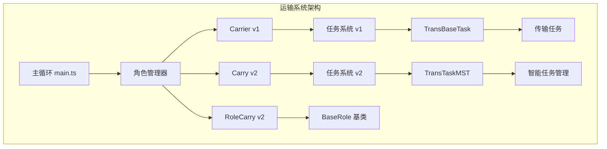
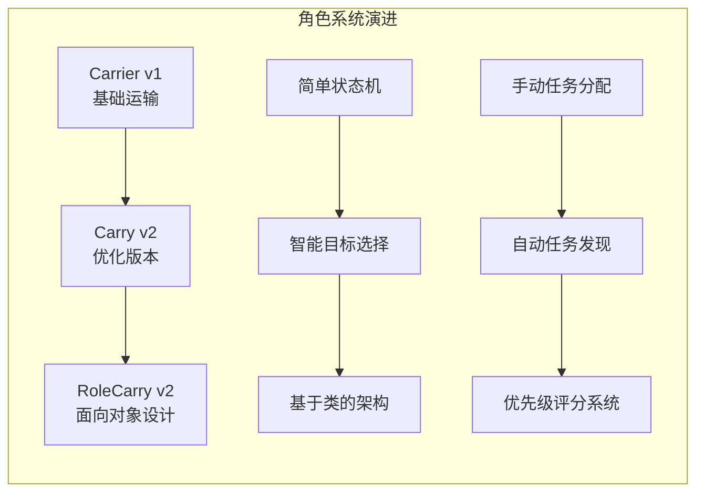
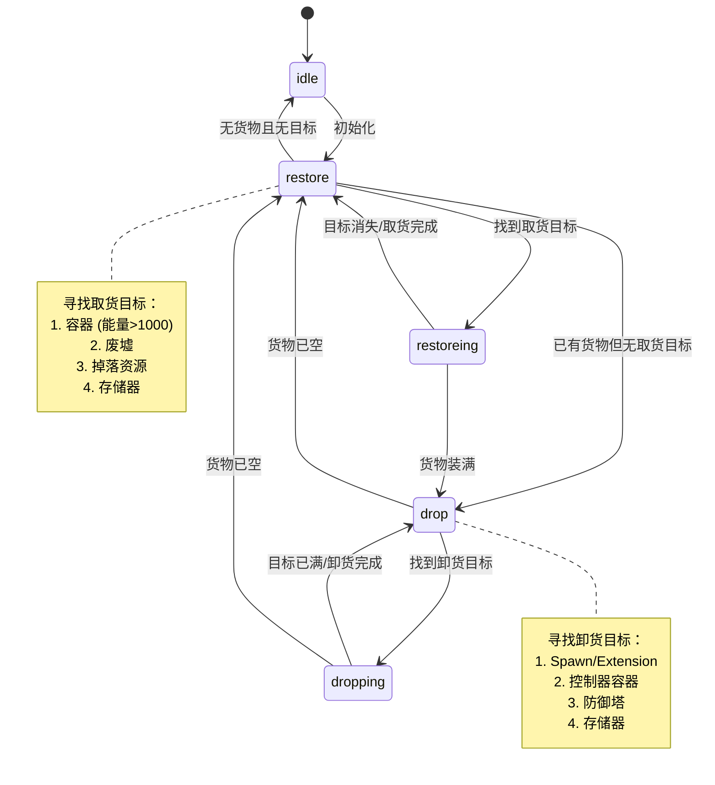
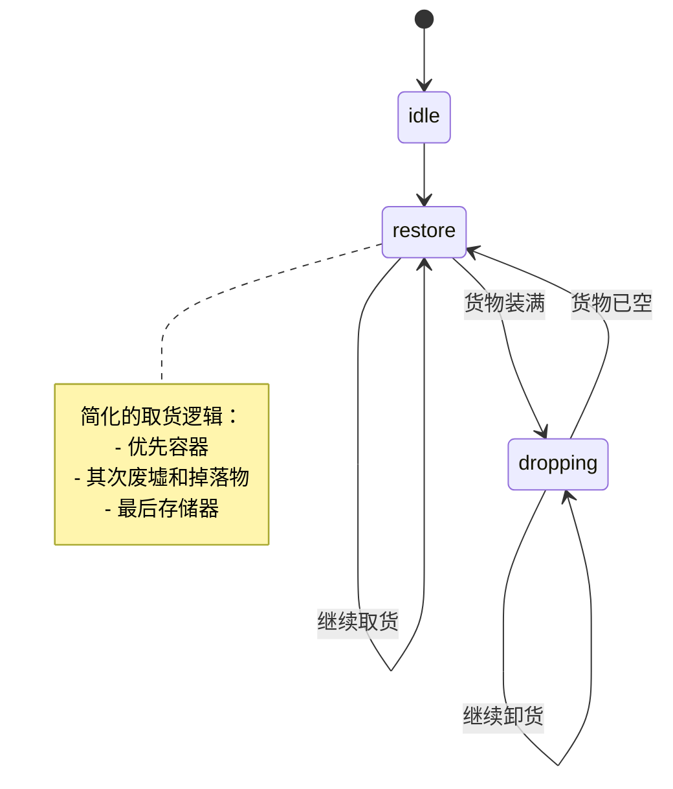
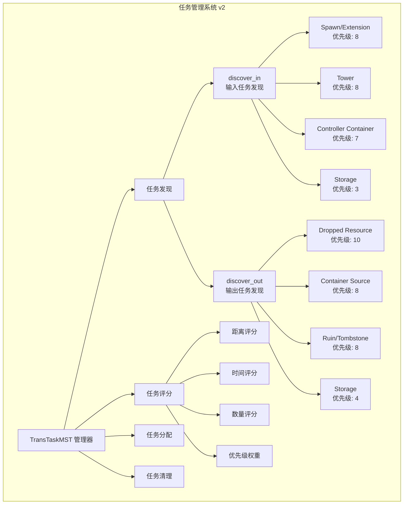
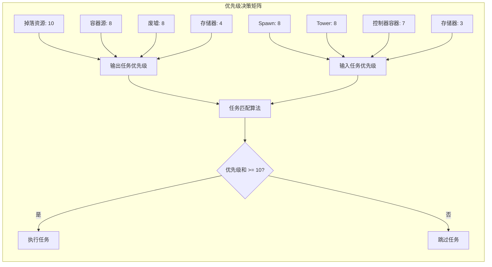
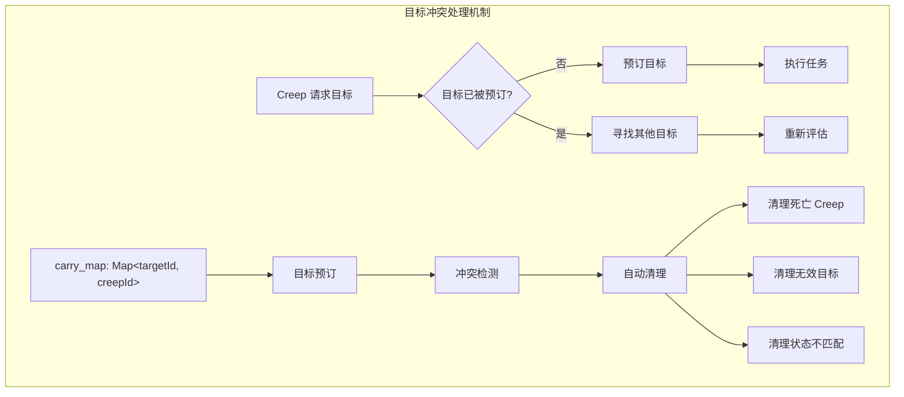
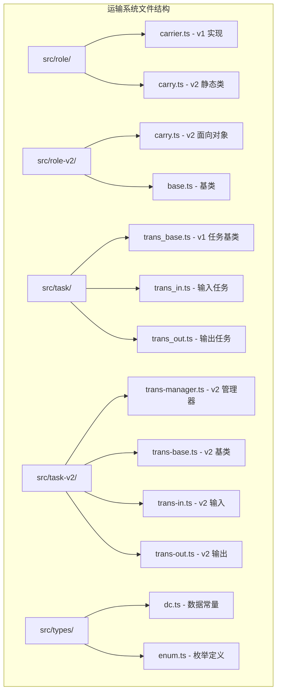
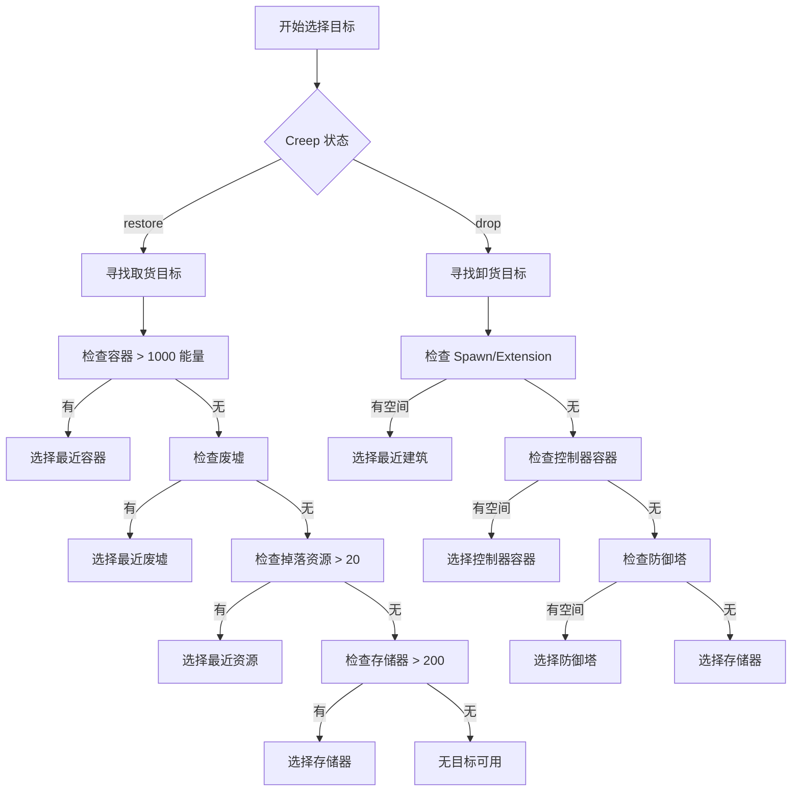
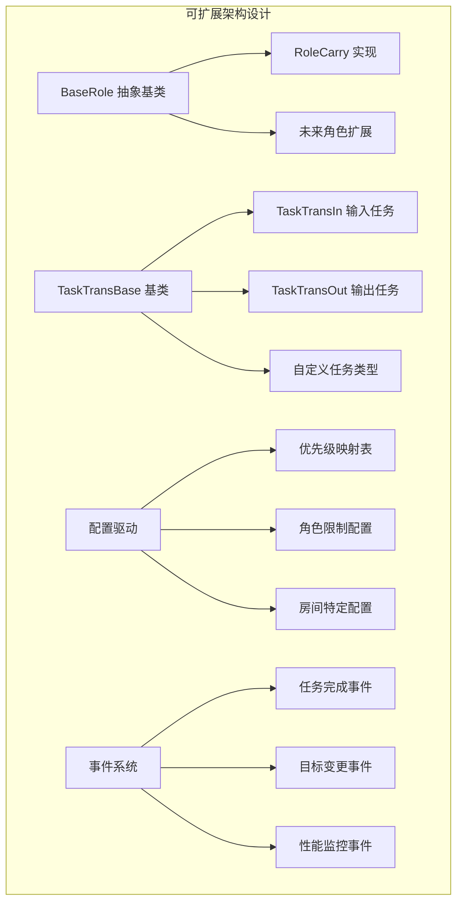

# Screeps 运输角色系统设计文档

## 概述

本文档详细描述了 Screeps TypeScript 项目中的运输角色系统设计。该系统采用分层架构，支持多版本并存，具有智能任务分配和优先级管理机制。

## 系统架构概览



## 角色版本对比

### 版本演进图



### 功能对比表

| 特性         | Carrier v1 | Carry v2   | RoleCarry v2 |
| ------------ | ---------- | ---------- | ------------ |
| 架构模式     | 函数式     | 静态类     | 面向对象     |
| 状态管理     | 简单枚举   | 智能检查   | 基类继承     |
| 任务分配     | 手动查找   | 自动发现   | 抽象接口     |
| 优先级系统   | 无         | 复杂评分   | 可扩展       |
| 目标冲突处理 | 基础       | 映射表管理 | 待实现       |

## 状态机设计

### Carry v2 状态流转图



### Carrier v1 状态流转图



## 任务系统架构

### 任务系统 v2 (TransTaskMST) 架构图



### 任务优先级矩阵



## 目标冲突处理

### Carry v2 目标映射系统



## 性能优化策略

### 缓存和优化机制

```mermaid
graph TB
    subgraph "性能优化架构"
        A[缓存系统] --> B[目标缓存]
        A --> C[任务缓存]
        A --> D[路径缓存]

        B --> E[@CacheId 装饰器]
        B --> F[@CacheIds 装饰器]

        C --> G[tick_cache 函数缓存]
        C --> H[任务映射表]

        D --> I[可视化路径样式]
        D --> J[移动优化]

        K[定期清理] --> L[每 tick 清理映射]
        K --> M[清理无效任务]
        K --> N[清理死亡对象]
    end
```

## 代码结构分析

### 文件组织架构



## 关键算法实现

### 任务评分算法

```mermaid
graph LR
    subgraph "任务评分算法"
        A[输入参数] --> B[距离因子]
        A --> C[时间因子]
        A --> D[数量因子]
        A --> E[优先级因子]

        B --> F[log2(range + 1)]
        C --> G[(Game.time - last_time) / 3]
        D --> H[min(amount, 50)]
        E --> I[task.rank]

        F --> J[综合评分]
        G --> J
        H --> J
        I --> J

        J --> K[min(1, rank - range_factor)]
    end
```

### 目标选择流程



## 扩展性设计

### 插件化架构



## 最佳实践建议

### 1. 版本选择指南

- **新项目**: 推荐使用 Carry v2 (静态类版本)
- **面向对象需求**: 使用 RoleCarry v2 (基类继承版本)
- **简单场景**: 可考虑 Carrier v1

### 2. 性能优化要点

- 合理使用缓存装饰器
- 定期清理无效映射和任务
- 避免频繁的路径计算
- 使用可视化路径样式减少 CPU 消耗

### 3. 扩展开发建议

- 继承 BaseRole 类实现新角色
- 使用配置驱动的优先级系统
- 实现自定义任务评分算法
- 添加性能监控和调试信息

### 4. 调试和监控

- 使用 `creep.memory.debug` 存储调试信息
- 利用 `creep.say()` 显示当前状态
- 监控任务映射表大小和清理频率
- 跟踪任务完成率和效率指标

## 总结

Screeps 运输角色系统展现了从简单函数式设计到复杂面向对象架构的演进过程。v2 版本引入了智能任务管理、优先级评分和目标冲突处理机制，显著提升了系统的可靠性和效率。该设计为未来的功能扩展和性能优化提供了良好的基础架构。
